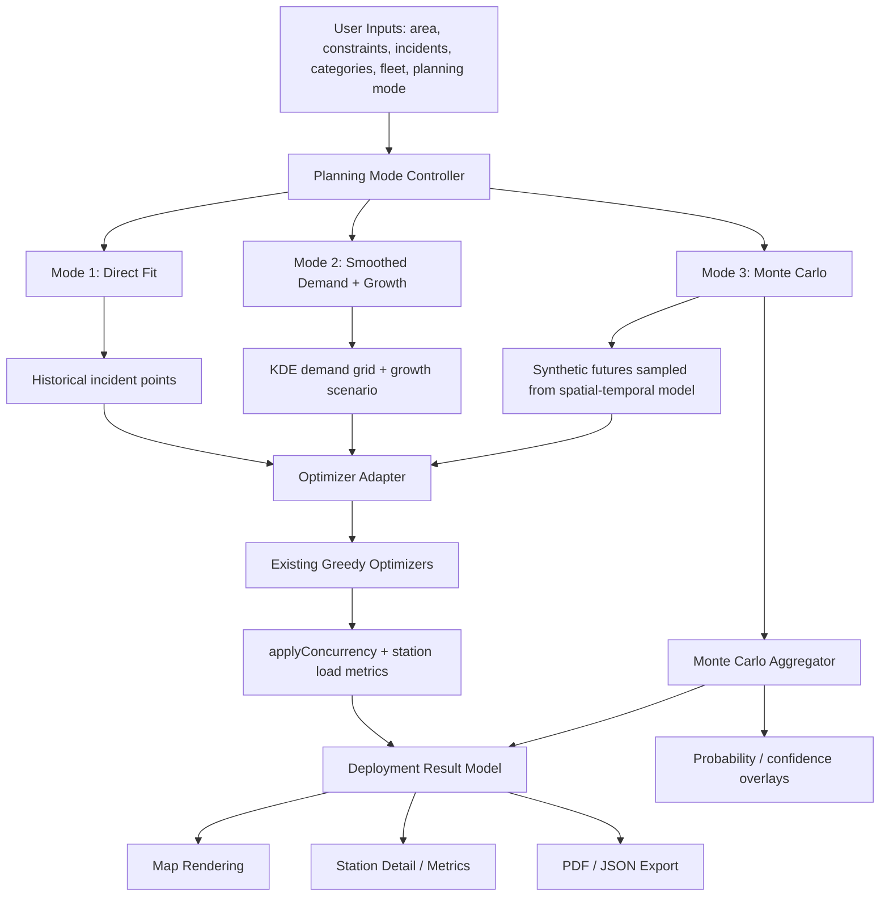

# Planning Modes Design

## REVISION 1

Changes from the first draft:

- Merged the former Direct Fit rename, KDE grid, and smoothed optimizer phases into one shippable "Smoothed Demand mode" phase after Phase 0.
- Resolved Mode 2 temporal trace handling: use historical timestamps weighted by proximity to assigned demand cells, then scale by growth for concurrency/load simulation.
- Removed the historical-incident-dependent `minDemandWeightPerSite` formula and replaced it with a weighted marginal-stop rule that works with synthetic-only demand.
- Promoted Monte Carlo aggregation bin size to a DECISION NEEDED item with tradeoffs.
- Specified Monte Carlo behavior when absolute timestamps are absent: warn the user and use uniform day/hour temporal sampling rather than pretending to model day-of-week/hour-of-day patterns.
- Strengthened Direct Fit warning copy to state that it is not suitable for procurement or annual deployment planning.
- Added a Mode 3 debuggability section covering run inspection, replay, outlier diagnosis, and exportable run summaries.

## CORRECTIONS

The current repository mostly matches the described architecture, with these corrections:

- The planner markup is now in `planner/index.html`, while root `index.html` is a landing/home page.
- `styles.css` is approximately 1,847 lines, not ~740 lines.
- `app.js` is approximately 5,800 lines, not ~3,800 lines, and already exceeds the requested ~5,500-line budget. This design therefore treats modularization as an early architecture milestone, not an optional future cleanup.
- Recent code already includes operational load metrics (`computeStationLoadMetrics`, `buildNetworkLoadSummary`) in addition to the older concurrency sizing path.
- The current build outputs both `dist/index.html` and `dist/planner/index.html`.

## Architecture Overview

The feature should add a planning-mode layer above the existing optimizer rather than replacing the optimizer. The current direct incident workflow remains intact as Mode 1. Modes 2 and 3 transform historical incidents into planning demand representations, then call wrapped optimizer entry points that preserve the existing function contracts where possible.



### Proposed Module Boundaries

Because `app.js` is already over budget, this feature should begin by extracting pure planning and optimizer helpers into modules while keeping the browser app behavior unchanged.

Suggested boundaries:

- `planner/planning-models.js`
  - planning-mode state schema
  - KDE grid construction
  - temporal profile fitting
  - synthetic future sampling
  - growth scaling helpers

- `planner/optimizer-adapter.js`
  - wrappers around `greedyMaxCoverage` and `greedyHeterogeneous`
  - conversion between demand grids, pseudo-incidents, and existing optimizer inputs
  - result normalization across modes

- `planner/monte-carlo.js`
  - Monte Carlo run orchestration
  - progress callbacks
  - aggregation into confidence intervals and station-frequency surfaces

- `planner/pdf-export.js`
  - PDF report composition
  - existing map capture logic can remain or be moved later

DECISION NEEDED: whether to modularize before any mode work or only after Mode 2. Recommendation: modularize planning-only logic first, but leave rendering and PDF in `app.js` until the feature stabilizes.

## Data Structure Changes

### Existing Types To Preserve

Existing incident category shape remains unchanged:

```js
IncidentCategory = {
  id: string,
  name: string,
  color: string,
  kpiSec: number,
  overheadSec: number,
  serviceLevel: number,
  weight: number
}
```

Existing incidents remain valid:

```js
Incident = {
  lat: number,
  lng: number,
  t: number,              // hours since anchor
  priority: string,
  timestamp?: string
}
```

### New Planning Mode State

Add one top-level planning state object rather than scattering globals:

```js
PlanningModeState = {
  mode: "direct-fit" | "smoothed-growth" | "monte-carlo",
  directFit: DirectFitSettings,
  smoothedGrowth: SmoothedGrowthSettings,
  monteCarlo: MonteCarloSettings,
  activeResultId: string | null,
  cachedResults: Record<string, PlanningResult>
}
```

Fields:

- `mode`: selected planning mode.
- `directFit`: settings specific to Mode 1.
- `smoothedGrowth`: settings specific to Mode 2.
- `monteCarlo`: settings specific to Mode 3.
- `activeResultId`: ID of the currently rendered result.
- `cachedResults`: optional preservation of mode-specific results for switching modes.

DECISION NEEDED: preserve cached mode-specific state when switching modes, or clear it. Recommendation: preserve settings and derived model caches, but clear rendered deployment unless the user explicitly switches back to a previous result.

### Mode 1 Settings

```js
DirectFitSettings = {
  coverageTargetPct: number,
  minIncidentsPerSite: number,
  warningAcknowledged: boolean
}
```

Fields:

- `coverageTargetPct`: existing planning realism setting.
- `minIncidentsPerSite`: existing outlier control.
- `warningAcknowledged`: tracks whether the user has dismissed the overfit warning for the current session.

### Mode 2 Settings

```js
SmoothedGrowthSettings = {
  gridResolution: number,
  bandwidthMode: "auto-silverman" | "fixed" | "manual",
  bandwidthMeters: number | null,
  growthMultiplier: 1 | 1.25 | 1.5 | 2,
  demandThresholdPct: number,
  useCategoryWeights: boolean
}
```

Fields:

- `gridResolution`: cells per side for the KDE grid. Default: `100`.
- `bandwidthMode`: KDE bandwidth selection mode.
- `bandwidthMeters`: fixed/manual bandwidth when relevant.
- `growthMultiplier`: demand volume multiplier, not a station-placement multiplier.
- `demandThresholdPct`: ignore cells below this percentage of max cell weight to reduce noise. Default: `1`.
- `useCategoryWeights`: whether incident category weights affect grid-cell demand. Default: `true`.

DECISION NEEDED: default bandwidth policy. Recommendation: `auto-silverman` with an advanced manual override.

### Mode 3 Settings

```js
MonteCarloSettings = {
  runCount: number,
  growthMultiplier: 1 | 1.25 | 1.5 | 2,
  confidenceLevel: 0.8 | 0.9 | 0.95,
  robustCoreThresholdPct: number,
  randomSeed: number | null,
  maxRuntimeSec: number,
  visualizationMode: "frequency-markers" | "consensus-overlay"
}
```

Fields:

- `runCount`: number of synthetic futures. Default: `30`, range `10-100`.
- `growthMultiplier`: scales expected synthetic incident count.
- `confidenceLevel`: interval displayed in report and UI.
- `robustCoreThresholdPct`: station recurrence threshold for robust core. Default: `60`.
- `randomSeed`: optional reproducibility seed.
- `maxRuntimeSec`: soft cap for user feedback. Default: `60`.
- `visualizationMode`: selected Monte Carlo visualization.

### KDE Demand Grid

```js
DemandGrid = {
  id: string,
  bounds: {
    south: number,
    west: number,
    north: number,
    east: number
  },
  resolution: number,
  cellWidthMeters: number,
  cellHeightMeters: number,
  bandwidthMeters: number,
  totalWeight: number,
  cells: DemandCell[]
}

DemandCell = {
  row: number,
  col: number,
  lat: number,
  lng: number,
  weight: number,
  normalizedWeight: number,
  categoryWeights: Record<string, number>,
  insideArea: boolean,
  deployable: boolean
}
```

Fields:

- `bounds`: operational-area bounding box.
- `resolution`: grid side length.
- `cellWidthMeters`, `cellHeightMeters`: approximate cell dimensions.
- `bandwidthMeters`: selected KDE bandwidth.
- `totalWeight`: sum of all active cell weights after filtering.
- `cells`: flattened grid cells.
- `categoryWeights`: per-category density mass for KPI/radius behavior.
- `insideArea`: whether the cell center is inside the operational area.
- `deployable`: whether a station may be placed at that cell center.

### Optimizer Demand Input

To preserve the existing optimizer public API, use an adapter that can convert demand cells into weighted pseudo-incidents.

```js
OptimizerDemandPoint = {
  lat: number,
  lng: number,
  t: number,
  priority: string,
  weight: number,
  source: "incident" | "grid-cell" | "synthetic",
  cellId?: string,
  syntheticRunId?: string
}
```

Modified type:

- Existing optimizer inputs should accept incidents with optional `weight`.
- Existing code that does not know `weight` must behave as if `weight = category.weight || 1`.

DECISION NEEDED: whether to add `weight` directly to incidents or keep it only in adapter-owned pseudo-incidents. Recommendation: allow optional `weight` in optimizer demand points, but do not mutate uploaded historical incidents.

### Planning Result

```js
PlanningResult = {
  id: string,
  mode: "direct-fit" | "smoothed-growth" | "monte-carlo",
  createdAt: string,
  settingsSnapshot: object,
  stations: StationResult[],
  coverage: CoverageSummary,
  kpi: KpiSummary,
  load: LoadSummary,
  directFit?: DirectFitResultMeta,
  smoothedGrowth?: SmoothedGrowthResultMeta,
  monteCarlo?: MonteCarloResultMeta
}
```

### Station Result Additions

Existing station objects should gain these optional fields:

```js
StationResult = ExistingStation & {
  planningMode?: "direct-fit" | "smoothed-growth" | "monte-carlo",
  demandWeight?: number,
  expectedIncidents?: number,
  demandCellIds?: string[],
  syntheticRunFrequencyPct?: number,
  confidence?: {
    latStdMeters: number,
    lngStdMeters: number,
    kpiLowPct: number,
    kpiHighPct: number,
    loadLowPct: number,
    loadHighPct: number
  }
}
```

### Monte Carlo Aggregates

```js
MonteCarloResultMeta = {
  runCount: number,
  completedRuns: number,
  growthMultiplier: number,
  robustCoreThresholdPct: number,
  stationFrequencyCells: StationFrequencyCell[],
  robustCoreStations: StationResult[],
  kpiIntervalPct: Interval,
  stationCountInterval: Interval,
  unitCountInterval: Interval,
  loadIntervalPct: Interval,
  runSummaries: MonteCarloRunSummary[]
}

StationFrequencyCell = {
  lat: number,
  lng: number,
  frequencyPct: number,
  meanUnits: number,
  meanLoadPct: number
}

Interval = {
  low: number,
  median: number,
  high: number,
  confidenceLevel: number
}

MonteCarloRunSummary = {
  runId: string,
  seed: number,
  incidentCount: number,
  stationCount: number,
  unitCount: number,
  kpiPct: number,
  coveragePct: number,
  loadPct: number
}
```

### Export Versioning

Saved JSON should remain backward compatible.

Add:

```js
SavedPlanEnvelope = {
  fileType: "uasc-dfr-plan",
  version: 2,
  planningModeState: PlanningModeState,
  legacy?: object
}
```

Load rules:

- Missing `version`: treat as version `1`.
- Missing `planningModeState`: infer `mode = "direct-fit"`.
- Missing planning fields: populate defaults.
- Unknown future fields: preserve when re-saving if practical.

DECISION NEEDED: whether exports should include full Monte Carlo run details or only aggregates. Recommendation: include aggregates by default; include full run summaries only when an "Appendix JSON snapshot" checkbox is selected.

## Algorithm Specifications

### Shared Planning Mode Entry Point

All modes should run through one controller:

```js
runPlanningMode({
  mode,
  incidents,
  areaPolygon,
  constraints,
  categories,
  fleetTypes,
  kpi,
  planningModeState,
  onProgress
}) => Promise<PlanningResult>
```

Rules:

1. Validate operational area and incident data.
2. Read selected mode settings.
3. Produce mode-specific demand representation.
4. Call optimizer adapter.
5. Run `applyConcurrency`.
6. Compute station load metrics.
7. Normalize into `PlanningResult`.
8. Render result.

### Mode 1: Direct Fit

Purpose: preserve existing behavior.

Algorithm:

1. Use current incident array unchanged.
2. Use existing `greedyMaxCoverage` or `greedyHeterogeneous`.
3. Apply existing `coverageTargetPct` and `minIncidentsPerSite`.
4. Run `applyConcurrency` exactly as today.
5. Mark result metadata:

```js
directFit: {
  overfitWarning: true,
  inputIncidentCount: incidents.length
}
```

UI must explicitly warn that this mode optimizes around fixed historical points and can overfit outliers.

### Mode 2: Smoothed Demand + Growth

Purpose: robust annual planning for demand pattern rather than exact historical points.

#### KDE Grid Construction

Inputs:

- `incidents`
- `areaPolygon`
- `incidentCategories`
- `gridResolution`
- `bandwidthMeters`
- `demandThresholdPct`

Steps:

1. Compute bounding box of operational area.
2. Create `gridResolution × gridResolution` cell centers.
3. Mark cells outside the operational area as inactive.
4. For each active cell, compute KDE weight:

```text
cellWeight = sum over incidents:
  incidentCategoryWeight *
  exp(-0.5 * (distanceMeters(cell, incident) / bandwidthMeters)^2)
```

5. Compute per-category weights using the same kernel but only accumulating incidents in each category.
6. Normalize weights:

```text
normalizedWeight = cellWeight / sum(all active cell weights)
```

7. Drop cells where:

```text
cellWeight < maxCellWeight * demandThresholdPct / 100
```

8. Store the grid in `PlanningResult.smoothedGrowth.demandGrid`.

Runtime optimization:

- Do not compare every incident to every cell if avoidable.
- For each incident, only update cells within `3 × bandwidthMeters`.
- Precompute approximate meters-per-degree at area center.
- Use typed arrays internally if app performance requires it.

DECISION NEEDED: grid resolution. Recommendation:

- Default: `100 × 100`.
- For <250 incidents: `80 × 80` is enough.
- For 250-2,000 incidents: `100 × 100`.
- Advanced option: `150 × 150` only if the user wants finer detail and accepts slower runs.

Tradeoff:

- `80 × 80`: faster, smoother, may hide small hotspots.
- `100 × 100`: good default for city-scale planning.
- `150 × 150`: sharper but more likely to exceed the 3-second budget without spatial pruning.

#### Bandwidth Selection

Default:

```text
bandwidth = clamp(
  1.06 * min(stdDistance, IQRDistance / 1.34) * n^(-1/5),
  minBandwidth,
  maxBandwidth
)
```

Where:

- `stdDistance`: standard deviation of incident coordinates projected to meters around centroid.
- `IQRDistance`: interquartile radial distance.
- `minBandwidth`: `max(300m, 1.5 × cell diagonal)`.
- `maxBandwidth`: `25%` of the operational-area diagonal.

DECISION NEEDED: bandwidth policy.

Options:

- Fixed value:
  - Pros: predictable and explainable.
  - Cons: poor across different city sizes.

- Silverman's rule:
  - Pros: automatic, standard, low UI burden.
  - Cons: can oversmooth multi-center cities or sparse datasets.

- User-adjustable slider:
  - Pros: expert control.
  - Cons: invites tuning to get desired answer.

Recommendation: use Silverman auto by default, show an advanced "Smoothing radius" control only in expanded settings.

#### Grid-Weighted Greedy Optimization

The existing greedy optimizers are point based. Wrap them by converting high-value grid cells into weighted pseudo-incidents.

Pseudo-incident generation:

1. For each active demand cell, determine dominant category:

```text
dominantCategory = category with max categoryWeights[categoryId]
```

2. Create:

```js
{
  lat: cell.lat,
  lng: cell.lng,
  t: representativeTime,
  priority: dominantCategory,
  weight: cell.weight,
  source: "grid-cell",
  cellId
}
```

3. `representativeTime` is not used for station placement. For load/concurrency simulation, Mode 2 must build a station-specific temporal trace by reusing historical timestamps weighted by their proximity to assigned cells:
   - For every demand cell assigned to a station, compute nearby historical incidents within `3 × bandwidthMeters`.
   - Weight each nearby incident by the same Gaussian kernel used by KDE.
   - Sample historical incident `t` values with replacement according to those proximity weights.
   - If a cell has no nearby historical incidents, fall back to the global hourly distribution.
   - The number of samples for that cell is proportional to `cell.normalizedWeight × effectiveDemandUnits × growthMultiplier`, where `effectiveDemandUnits` follows the same definition used by the weighted marginal-stop rule below.
   - The resulting sampled trace is passed to `applyConcurrency` and station load metrics.

Chosen option: (c) reuse historical timestamps weighted by their proximity to assigned cells.

Rationale:

- It preserves real temporal burst structure where historical evidence exists.
- It is station-specific, so a station serving a nightlife hotspot can inherit a different time profile than a station serving commuter corridors.
- It avoids inventing a fully synthetic temporal model for Mode 2, keeping Monte Carlo as the advanced stochastic mode.
- It still works when demand cells are synthetic because the timestamps come from the nearest historical temporal evidence or the global fallback.

Optimizer changes:

- Modify weighted scoring in greedy candidate selection:

```text
candidateScore = sum(uncovered demandPoint.weight)
```

- Coverage target becomes weighted:

```text
coveredWeight / totalWeight >= coverageTarget
```

- `minIncidentsPerSite` becomes a weighted marginal-stop rule in Mode 2 rather than an absolute demand formula tied to historical incident count.

```text
candidateMarginalShare = candidateAddedWeight / totalWeight
minMarginalShare = min(0.05, max(0.005, minIncidentsPerSite / max(100, effectiveDemandUnits)))

accept next station iff candidateMarginalShare >= minMarginalShare
```

Where:

- `candidateAddedWeight` is the uncovered demand weight newly covered by the next station.
- `totalWeight` is total active demand-grid weight.
- `effectiveDemandUnits` is:
  - historical incident count when historical incidents exist.
  - otherwise, the user-selected synthetic demand volume if present.
  - otherwise, Mode 2 is blocked with a prompt asking the user to load incident data or choose a synthetic demand volume first.
- The clamp keeps the threshold between `0.5%` and `5%` of total demand, so it works for historical, sparse, and synthetic-demand cases without inventing a fallback volume.

Alternative if this feels too abstract: expose "Minimum marginal demand (%)" in advanced settings, default `1%`.

DECISION NEEDED: whether to expose a separate "minimum marginal demand (%)" control for Mode 2. Recommendation: do not expose initially; derive it from existing `minIncidentsPerSite` using the weighted marginal-stop rule.

#### Growth Scenario

Growth multiplier affects simulation volume and unit sizing, not station placement.

Steps:

1. Build station placement using baseline KDE weights.
2. Assign historical or pseudo demand to stations.
3. Scale demand for load simulation:

```text
scaledIncidentCount = round(baselineAssignedDemandCount * growthMultiplier)
```

4. For each station, create a scaled demand trace:
   - If historical timestamps exist, resample assigned incidents with replacement until target count.
   - If no useful timestamps exist, sample times from global hourly profile.
5. Run `applyConcurrency` and station load metrics on scaled trace.
6. Store both baseline and growth metrics:

```js
growth: {
  multiplier,
  baselineStations,
  growthUnitsRequired,
  growthLoadPct,
  growthQueueRiskPct
}
```

Robustness metric:

For Mode 2, "robustness" should compare station locations across growth scenarios, not across random futures.

Algorithm:

1. Run placement for +0%, +25%, +50%, +100% using the same KDE station placement math.
2. Because placement is not scaled by growth, station locations should remain stable if the algorithm is implemented as specified.
3. Robustness should therefore report:

```text
locationShiftMeters = 0 for placement-only growth
unitSensitivity = units(+scenario) - units(baseline)
loadSensitivity = load(+scenario) - load(baseline)
```

DECISION NEEDED: The requested "how station locations shift across growth scenarios" conflicts with "growth scales simulation volume but not station-placement math." If station placement is not scaled, locations should not shift. Options:

- Option A: Keep placement fixed and report unit/load sensitivity. This is consistent with the stated algorithm.
- Option B: Allow growth to also alter placement if category mix or spatial growth assumptions are introduced. More complex and easier to over-explain.

Recommendation: Option A for first release; label the metric "growth sensitivity" rather than "location robustness."

### Mode 3: Monte Carlo

Purpose: confidence intervals and procurement defensibility.

#### Spatial Model

Use Mode 2 KDE grid as spatial intensity.

Sampling:

1. Build or reuse `DemandGrid`.
2. Create cumulative distribution over active cells:

```text
cdf[i] = cumulative normalizedWeight
```

3. For each synthetic incident:
   - Draw random `u ∈ [0,1)`.
   - Select cell by binary search on CDF.
   - Jitter location within cell bounds.
   - Reject if outside operational area or inside excluded no-fly incident area.
   - Assign category by `cell.categoryWeights`.

#### Temporal Model

Fit a non-homogeneous Poisson profile by hour-of-day and day-of-week when absolute timestamps are available. If only relative `t` values are available, do not infer calendar day patterns.

```js
TemporalProfile = {
  hourlyWeights: number[24],
  dayOfWeekWeights: number[7],
  totalExpectedIncidents: number,
  observedPeriodHours: number
}
```

Fit steps with absolute timestamps:

1. Use incident timestamps when available.
2. Derive hour-of-day and day-of-week from each timestamp.
3. Apply Laplace smoothing:

```text
hourlyWeight[h] = (count[h] + 1) / (total + 24)
dayWeight[d] = (count[d] + 1) / (total + 7)
```

4. Expected future count:

```text
lambda = historicalCount * growthMultiplier
```

5. Sample total incident count from Poisson(lambda).

Behavior when absolute timestamps are absent:

1. Show a warning before running Monte Carlo:

```text
This incident file does not include absolute dates/times. Monte Carlo will model spatial uncertainty and total volume, but it will not model hour-of-day or day-of-week temporal patterns. Synthetic incident times will be sampled uniformly across the selected time window.
```

2. Set:

```text
hourlyWeights[h] = 1 / 24
dayOfWeekWeights[d] = 1 / 7
temporalModelQuality = "uniform-fallback"
```

3. Continue the run rather than blocking it.

If relative `t` values were generated by the app and are known to span the selected time window, they may still be used for overlap simulation inside each synthetic future, but the UI/report must label the temporal model as uniform fallback, not as a fitted non-homogeneous profile.

Vanilla JS Poisson sampler:

- For `lambda < 50`, use Knuth's algorithm.
- For `lambda >= 50`, use normal approximation:

```text
round(max(0, gaussian(lambda, sqrt(lambda))))
```

#### Synthetic Future Sampling

For each run:

1. Sample `incidentCount`.
2. For each incident:
   - sample spatial cell from KDE CDF.
   - sample category from cell category distribution.
   - sample day/hour using temporal profile.
   - sample minute offset uniformly within hour.
   - create `SyntheticIncident`.
3. Run optimizer adapter in Direct Fit mode over synthetic points or grid-weighted Mode 2 demand.

DECISION NEEDED: whether each Monte Carlo run should optimize raw synthetic incidents or a smoothed grid from each synthetic future.

Options:

- Raw synthetic incidents:
  - Pros: shows operational variance and overfit risk clearly.
  - Cons: noisy station locations; may require aggregation logic.

- Re-smoothed grid per future:
  - Pros: more stable, closer to planning pattern.
  - Cons: slower and partly hides uncertainty.

Recommendation: optimize raw synthetic incidents first, aggregate spatially afterward. This better reveals uncertainty.

#### Monte Carlo Orchestration

```js
runMonteCarlo({
  runCount,
  growthMultiplier,
  incidents,
  demandGrid,
  temporalProfile,
  optimizerSettings,
  onProgress
}) => Promise<MonteCarloResultMeta>
```

Runtime rules:

- Process runs in chunks of 1-3 using `setTimeout(..., 0)` or `requestIdleCallback` where available.
- Update progress after every run.
- Allow cancel.
- Keep N=30 default.
- Warn if estimated runtime exceeds 60 seconds.

#### Aggregation

Station-frequency map:

1. Define aggregation grid or clustering radius.
2. For every station from every run, add it to a spatial bin.
3. Compute:

```text
frequencyPct = runsWithStationInBin / runCount * 100
meanUnits = average units for stations in bin
meanLoadPct = average station load in bin
```

DECISION NEEDED: Monte Carlo aggregation bin size.

Options:

- Fixed 500m bin:
  - Pros: stable, easy to explain, comparable across reports.
  - Cons: too coarse for small districts, too fine for large rural/metro regions.

- Bandwidth-derived bin: `max(500m, KDE bandwidth / 2)`.
  - Pros: aligns uncertainty aggregation with the smoothing scale used by the spatial model.
  - Cons: bin size changes between projects, which can make reports less directly comparable.

- Platform-radius-derived bin: `minPlatformRadius × 0.25`.
  - Pros: tied to operational reach and procurement reality.
  - Cons: fleet selection can change the visualization even if incident uncertainty did not change.

Recommendation: use bandwidth-derived binning for the algorithm, and print the chosen bin size in the Monte Carlo report. If leadership comparability becomes more important than spatial fidelity, switch to fixed 500m.

Robust core:

```text
robustCoreStations = bins where frequencyPct >= robustCoreThresholdPct
```

KPI intervals:

1. Collect `kpiPct`, `stationCount`, `unitCount`, `loadPct` per run.
2. Sort each metric.
3. For 90% interval, use 5th and 95th percentiles.
4. Median is 50th percentile.

DECISION NEEDED: robust-core threshold. Recommendation: default 60%, advanced slider 50-80%.

#### Concurrency Simulation In Mode 3

DECISION NEEDED: whether existing concurrency simulation needs changes.

Analysis:

- The current simulation already handles per-station incident timing and unit availability.
- Mode 3 creates different synthetic incident timing per run, which is exactly what the existing simulation can consume.
- Required change: ensure `applyConcurrency` receives the synthetic run's incident trace, not the original incidents.
- Optional change: return per-run load metrics for confidence intervals.

Recommendation: keep the simulation algorithm unchanged; change only orchestration and result aggregation.

## UI/UX Changes

### Mode Selector

Location: Step 03, above Planning Realism.

Control:

```text
Planning Mode
[Smoothed Demand + Growth] [Direct Fit] [Monte Carlo]
```

Default: `Smoothed Demand + Growth`.

Progressive disclosure:

- Show only mode title, one-line purpose, and primary controls.
- Advanced controls appear behind "Advanced planning settings."

### Mode 1 UI: Direct Fit

Visible controls:

- Coverage Target (%)
- Min Incidents / Site

Warning panel:

```text
Direct Fit places stations around the exact incidents loaded in this session. It is useful for forensic review, fixed-event planning, and explaining how a known historical period would have been covered. It is not suitable for procurement planning or annual deployment sizing because it can overfit isolated calls, missing records, and random historical noise. For station investment decisions, use Smoothed Demand + Growth or Monte Carlo.
```

### Mode 2 UI: Smoothed Demand + Growth

Visible controls:

- Demand Growth Scenario:

```text
[+0%] [+25%] [+50%] [+100%]
```

- Coverage Target (%)
- Min Incidents / Site

Advanced controls:

- Smoothing radius:
  - `Auto` default.
  - Manual meters input if advanced expanded.
- Grid resolution:
  - `80`, `100`, `150`.
  - Default `100`.
- Ignore low-demand cells (% of peak):
  - Default `1%`.

Map:

- Demand heat layer from KDE grid.
- Station markers placed over smoothed demand.
- Optional toggle: show original incidents.

Headline metrics:

- Stations needed.
- Units needed under selected growth.
- Expected network load.
- Queue risk.
- Growth sensitivity:
  - baseline units
  - +25 / +50 / +100 unit deltas

### Mode 3 UI: Monte Carlo

Visible controls:

- Run count:
  - default `30`
  - range `10-100`
- Growth scenario.
- Confidence level:
  - default `90%`
- Run button with progress:

```text
Running Monte Carlo 12 / 30...
[Cancel]
```

Advanced controls:

- Robust core threshold.
- Optional random seed.
- Visualization mode.

### Monte Carlo Visualization Options

DECISION NEEDED: visualization approach.

Option A: Probability-weighted station markers

- Render aggregated station-frequency bins as station markers.
- Marker size and opacity reflect frequency.
- Label shows `72%`, `48%`, etc.

Pros:

- Easy for leadership to understand.
- Works with existing marker layer.
- Compact for PDF.

Cons:

- Can imply exact candidate sites where there is really a cluster of possibilities.

Option B: Consensus deployment overlay

- Compute robust core stations above threshold.
- Render them as primary stations.
- Render lower-frequency stations as faint alternatives.

Pros:

- Produces a procurement-friendly answer.
- Aligns with "what should we buy first?"

Cons:

- Hides the uncertainty distribution unless users open advanced detail.

Option C: Frequency heatmap

- Render station placement frequency as a heatmap surface.

Pros:

- Best representation of uncertainty.

Cons:

- Harder to read as discrete procurement sites.
- PDF may become visually dense.

Recommendation: implement Option B as default, with Option A toggle in advanced mode. Defer Option C unless users ask for deeper analysis.

### PDF Changes

DECISION NEEDED: probabilistic results in single-page leadership PDF.

Options:

- Keep one-page report and replace marginal charts with sensitivity summary in Monte Carlo mode.
- Add a second optional "Sensitivity Analysis" page only for Monte Carlo.

Recommendation:

- Direct Fit and Mode 2: keep one page.
- Monte Carlo: add optional second page by default, titled "Sensitivity Analysis."
- First page still shows the consensus deployment, median KPI, median units, and robust core count.
- Second page shows confidence intervals, station-frequency table, and a concise explanation of run count/growth settings.

Monte Carlo first-page leadership metrics:

```text
Robust Core Sites: 8
Median Units: 14
KPI 90% CI: 91-97%
Station Count 90% CI: 7-10
```

### Mode 3 Debuggability

Monte Carlo needs an inspection path because aggregate results can look surprising even when individual runs are valid.

Add an advanced "Inspect Runs" panel after a Monte Carlo result completes.

User-visible controls:

- Run summary table:
  - run number
  - seed
  - synthetic incident count
  - station count
  - unit count
  - KPI %
  - network load %
  - queue risk %
  - warning flags
- Sort by:
  - worst KPI
  - most stations
  - most units
  - highest load
  - largest distance from median result
- Actions:
  - "View Run"
  - "Compare To Consensus"
  - "Export Run Summary CSV"
  - "Copy Run Seed"

View Run behavior:

1. Temporarily render that run's synthetic incidents and station deployment on the map.
2. Show a banner:

```text
Inspecting Monte Carlo run 14 of 30. This is a sampled future, not the consensus plan.
```

3. Provide "Return to Consensus" to restore the aggregate overlay.
4. Preserve the aggregate result in memory while inspecting.

Compare To Consensus behavior:

- Draw run stations with thin outlines.
- Draw robust core stations with filled markers.
- Show station count/unit count/KPI delta versus median.

Data retained for debugging:

```js
MonteCarloRunDebug = {
  runId: string,
  seed: number,
  syntheticIncidents?: SyntheticIncident[],
  stations: StationResult[],
  summary: MonteCarloRunSummary,
  warnings: string[]
}
```

Memory rule:

- Keep full `syntheticIncidents` only for the best run, worst KPI run, highest unit-count run, and the currently inspected run.
- Keep all run summaries.
- If the user enables "retain all run details" in advanced settings, include all synthetic incidents in memory/export with a warning about file size.

Debug export:

- CSV summary export for all runs.
- JSON debug export only when "Appendix JSON snapshot" is checked.

This makes Mode 3 auditable without making the default leadership view noisy.

## Phasing Plan

### Phase 0: Planning-Only Refactor

Scope:

- Add module boundaries for planning helpers without changing UI behavior.
- Introduce `PlanningModeState` defaults.
- Add versioned saved-plan migration scaffolding.

Estimate: 1.5-2.5 days.

Shippable outcome:

- App behaves exactly as today.
- Code is ready for Mode 2 without growing `app.js` further.

### Phase 1: Smoothed Demand Mode

Scope:

- Add mode selector with Smoothed Demand + Growth as default and Direct Fit as secondary.
- Relabel existing behavior as Direct Fit.
- Add strengthened Direct Fit warning.
- Ensure saved plans load as Direct Fit.
- Build KDE grid.
- Add heat visualization from grid cells.
- Add advanced settings for resolution and bandwidth.
- Convert demand grid into weighted pseudo-incidents.
- Add weighted greedy scoring and weighted coverage.
- Add station-specific temporal trace sampling from nearby historical incidents.
- Add growth multiplier and load/unit sensitivity.
- Update JSON/PDF to record mode, KDE settings, growth scenario, and Direct Fit warning where applicable.

Estimate: 7 days.

Shippable outcome:

- Complete default planning mode for annual operational planning.
- Direct Fit remains available and behavior-compatible with existing deployments.

### Phase 2: Monte Carlo Core

Scope:

- Fit spatial-temporal model.
- Sample synthetic futures.
- Run N optimizations with progress/cancel.
- Aggregate intervals and station frequency bins.

Estimate: 5-8 days.

Shippable outcome:

- Advanced mode produces confidence intervals and robust core result.

### Phase 3: Monte Carlo Visualization And PDF

Scope:

- Add consensus overlay / probability marker visualization.
- Add sensitivity page to PDF.
- Add JSON aggregate export.

Estimate: 3-5 days.

Shippable outcome:

- Procurement-defensible report output.

## Decision Points

### DECISION NEEDED: Grid Resolution

Recommendation: default `100 × 100`.

Rationale:

- It is detailed enough for city-scale hotspots.
- With spatial pruning, it should fit the <3 second Mode 2 budget for ~1,000 incidents.
- `150 × 150` risks slower runs and noisier interpretation.

### DECISION NEEDED: KDE Bandwidth Selection

Recommendation: auto Silverman-style bandwidth with advanced manual override.

Rationale:

- Fixed bandwidth is too brittle across different operational areas.
- Always-visible slider invites result tuning.
- Auto default keeps the primary workflow opinionated.

### DECISION NEEDED: Monte Carlo Visualization

Recommendation: consensus deployment overlay by default, probability-weighted markers as alternate advanced view.

Rationale:

- Consensus overlay answers the procurement question.
- Probability markers preserve uncertainty without requiring a heatmap.

### DECISION NEEDED: Monte Carlo Aggregation Bin Size

Recommendation: bandwidth-derived binning, `max(500m, KDE bandwidth / 2)`, with the chosen bin size printed in the report.

Rationale:

- It keeps aggregation aligned with the spatial uncertainty model.
- It avoids fixed bins that are too coarse for compact areas or too fine for large areas.
- It is more defensible than tying aggregation to platform radius, which can make uncertainty appear to change when the fleet catalog changes.

### DECISION NEEDED: PDF Probabilistic Reporting

Recommendation: one leadership page plus optional sensitivity page for Monte Carlo.

Rationale:

- Direct Fit and Mode 2 stay single-page.
- Monte Carlo needs confidence intervals and station-frequency explanation.
- Forcing all probabilistic detail into one page would make it less trustworthy.

### DECISION NEEDED: Concurrency Simulation Changes

Recommendation: keep algorithm unchanged; feed each synthetic future into the existing simulation.

Rationale:

- The existing simulation already models timing, overlap, queue/load risk, and unit availability.
- The orchestration changes, not the simulation model.

### DECISION NEEDED: Backward Compatibility

Recommendation: version saved plans as `version: 2`, migrate missing planning state to Direct Fit defaults.

Rationale:

- Existing exports should load cleanly.
- Users should not lose old analyses.

### DECISION NEEDED: Mode Persistence

Recommendation: preserve settings and cached derived demand models per mode; clear rendered result on mode switch unless switching back to a cached result.

Rationale:

- Avoids frustrating users who tune advanced settings.
- Prevents accidentally presenting an old result under a new mode.

## Risk Register

| Risk | Impact | Likelihood | Mitigation |
|---|---:|---:|---|
| `app.js` grows further past maintainable size | High | High | Phase 0 modularization before Mode 2 implementation. |
| KDE is too slow for 1,000+ incidents | High | Medium | Spatial pruning to `3 × bandwidth`, typed arrays if needed, default 100 grid. |
| Smoothed demand hides critical outliers | Medium | Medium | Keep Direct Fit mode, add toggle to show original incidents, preserve category weights. |
| Users over-tune smoothing to justify preferred plan | Medium | Medium | Auto default, advanced controls collapsed, PDF records bandwidth and grid settings. |
| Growth scenario misunderstood as spatial growth | Medium | High | Label as "volume growth"; report unit/load sensitivity, not station-location shift. |
| Monte Carlo exceeds 60 seconds | High | Medium | Chunked execution, progress/cancel, run-count warning, default N=30. |
| Monte Carlo output feels too abstract for procurement | High | Medium | Default to consensus deployment with confidence intervals, not raw uncertainty surface. |
| Saved-plan compatibility breaks | High | Low | Versioned loader, migration tests, defaults for missing mode fields. |
| PDF becomes overcrowded | Medium | High | Keep one-page summary; use optional second sensitivity page only for Monte Carlo. |
| Station frequency aggregation creates misleading clusters | Medium | Medium | Use bandwidth-derived bin radius, label output as probability/frequency, show threshold. |
| Client memory pressure from storing all Monte Carlo runs | Medium | Medium | Store aggregates and summaries by default; full run detail only for appendix export. |

## Test Plan

### Phase 0 Tests

Verification:

- Existing Direct Fit output unchanged for a fixed seed/test dataset.
- `node --check` passes for all JS files.
- Build script still outputs home and planner pages.
- Existing saved plan loads.

Manual checks:

- Generate incidents.
- Compute deployment.
- Export PDF and JSON.
- Reload saved plan.

### Phase 1 Tests: Smoothed Demand Mode

Verification:

- Direct Fit mode produces same station count and coordinates as pre-change baseline.
- Warning appears only in Direct Fit.
- Saved version 1 file loads into Direct Fit mode.
- KDE grid cell count equals active area mask expectations.
- Total normalized weight sums to approximately `1`.
- Cells outside operational area are inactive.
- Bandwidth selection clamps to min/max.
- Weighted greedy prefers a dense cluster over isolated high-count outliers.
- Weighted coverage target stops at expected threshold.
- Direct Fit and Smoothed Demand produce different results on sparse outlier dataset.
- No-fly and no-deploy constraints still apply to grid-based pseudo-incidents.
- Mode 2 temporal traces sample from nearby historical incidents when available.
- Mode 2 falls back to global hourly distribution when a demand cell has no nearby historical evidence.
- Growth +0% equals baseline unit/load result.
- Growth +100% increases unit demand or load risk, not station placement.
- Growth setting is recorded in PDF and JSON.

Performance tests:

- 1,000 incidents, 100×100 grid completes under 3 seconds.
- 150×150 grid shows warning if slower.

Manual checks:

- Switch between Smoothed Demand and Direct Fit without losing mode settings.
- Confirm Direct Fit warning clearly says not suitable for procurement planning.
- KDE heat layer aligns with known incident hotspots.
- Original incident toggle overlays correctly.
- Current Direct Fit remains unchanged.
- Fleet and minimize modes still run.
- Headline metrics update when growth scenario changes.
- Station details show load changes under growth scenario.

### Phase 2 Tests: Monte Carlo Core

Statistical tests:

- Synthetic spatial samples follow KDE distribution within tolerance.
- Synthetic hourly samples follow fitted hourly profile within tolerance.
- Poisson sampler mean approximates lambda over many runs.

Runtime tests:

- N=30 completes under 60 seconds for ~1,000 incidents.
- Progress indicator updates after every run.
- Cancel stops safely and leaves app usable.

Aggregation tests:

- Confidence intervals computed from sorted run metrics.
- Robust core includes only bins above threshold.
- Re-running with same random seed produces same summaries.
- Runs without absolute timestamps show a temporal-model warning and use uniform day/hour weights.
- Individual run summaries can be opened and replayed from the debug panel.

### Phase 3 Tests: Monte Carlo Visualization And PDF

Visual tests:

- Consensus overlay is readable at desktop and laptop widths.
- Probability markers do not overlap station labels excessively.
- PDF sensitivity page includes run count, growth scenario, intervals, and robust core.

Export tests:

- JSON contains Monte Carlo aggregate metadata.
- Version 2 saved plans reload with selected mode and settings.
- Version 1 saved plans still load as Direct Fit.
